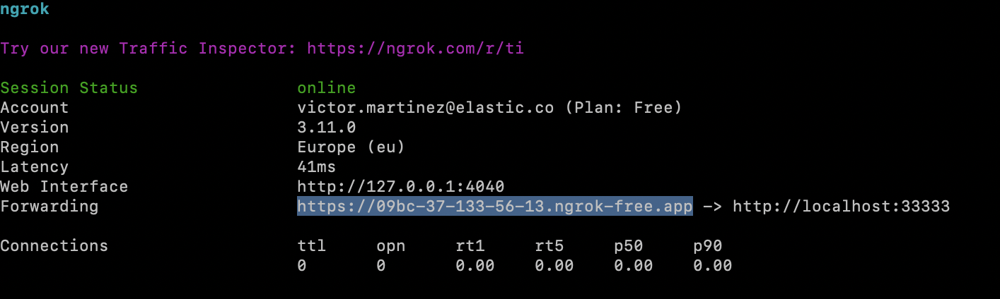
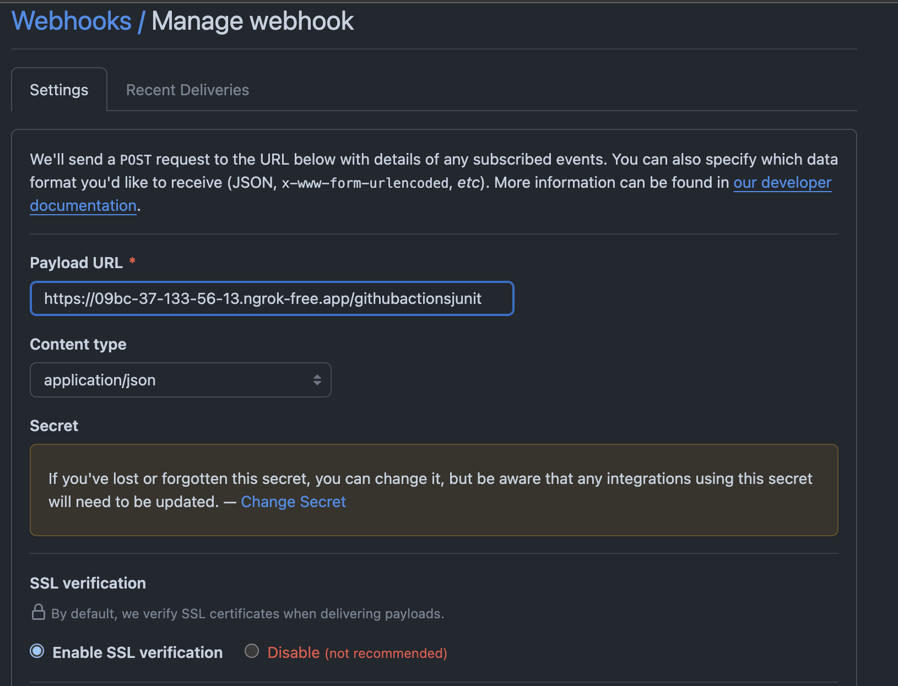

# opentelemetry-github-actions-junit-receiver


## Local Development

### Prerequisites

- [Go](https://golang.org/dl/)
- [Gh](https://cli.github.com/)

### Install tools

#### Ngrok

The [Ngrok](https://ngrok.com/download/) can be installed by running:

```shell
make install-ngrok
```

#### ocb

The [OpenTelemetry Collector Builder (OCB)](https://opentelemetry.io/docs/collector/custom-collector/#step-1---install-the-builder) can be installed by running:

```shell
make install-ocb
```

### Build the collector

```shell
make build
```

### Configure your GitHub repository for testing purposes

Open one terminal and run

```shell
make ngrok
```



Copy the `ngrok` URL and go to your GitHub repository, in this case we use `elastic/oblt-project-tmpl`:

* https://github.com/elastic/oblt-project-tmpl/settings/hooks
  * Payload: `https://3012-37-133-56-13.ngrok-free.app/githubactionsjunit` or the relevant `ngrok` URL
  * Content type: `application/json`
  * Secret: `secret` - fixed for now for testing purposes
  * `Enable SSL verification`
  * Individual events:
    * Workflow runs
    * Workflow jobs



### Run the collector

```shell
make run
```